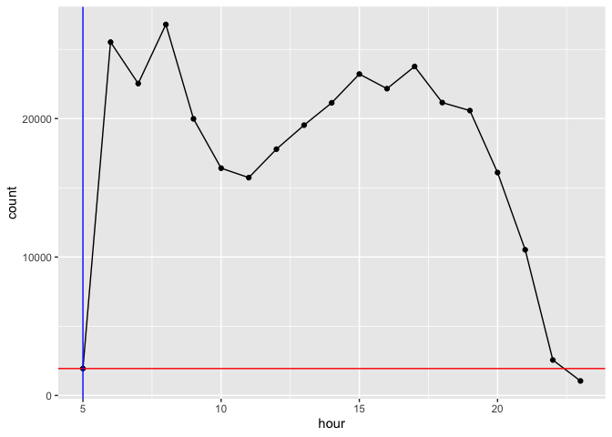

Homework 2
================
Christine Hou
2022-10-11

Github link: <https://github.com/christinehou/STAT433-HW2>

``` r
library(tidyverse)
```

    ── Attaching packages ─────────────────────────────────────── tidyverse 1.3.2 ──
    ✔ ggplot2 3.3.6      ✔ purrr   0.3.4 
    ✔ tibble  3.1.8      ✔ dplyr   1.0.10
    ✔ tidyr   1.2.1      ✔ stringr 1.4.1 
    ✔ readr   2.1.2      ✔ forcats 0.5.2 
    ── Conflicts ────────────────────────────────────────── tidyverse_conflicts() ──
    ✖ dplyr::filter() masks stats::filter()
    ✖ dplyr::lag()    masks stats::lag()

``` r
library(nycflights13)
library(dbplyr)
```


    Attaching package: 'dbplyr'

    The following objects are masked from 'package:dplyr':

        ident, sql

## Section I: What time of day should you fly if you want to avoid delays as much as possible?

``` r
flights %>% filter (dep_delay > 0) %>% 
  group_by(hour) %>%
  summarize(avg_delay = mean(dep_delay)) %>%
  arrange(avg_delay)
```

    # A tibble: 19 × 2
        hour avg_delay
       <dbl>     <dbl>
     1     5      15.3
     2     7      24.1
     3     6      24.2
     4     9      29.7
     5     8      29.9
     6    12      32.3
     7    11      32.5
     8    10      32.6
     9    13      33.5
    10    14      37.1
    11    23      38.0
    12    15      38.8
    13    16      43.4
    14    17      45.3
    15    18      46.5
    16    22      46.5
    17    20      49.6
    18    21      50.3
    19    19      51.1

> I choose the average of `dep_delay` as the standard (different from
> class notes, but i want to try another method). Generally, I filter
> the rows with positive `dep_delay` and group by `hour`, then calculate
> the average delay time named `avg_delay` to see the minimum value.
> It’s clear that the `avg_delay = 15.3` is the shortest when
> `hour = 5`, so the best choice to avoid delay time should be at 5am
> every day.

## Section II - What did the choice depend on?

> In this section, I would like to explore three aspects:
> `carrier_n`,`plane_n`, and `visib`. I use scatter plot with connected
> lines to see the overall distribution and change over time. The x-axis
> is the hour in one day, and y-axis is changed based on my interest in
> each part. According to the analysis, it’s clear to see that my three
> interests all have some impacts on how I choose the time to take
> flights for less delay. At 5am, all airports tend to have less
> carriers, less total plane counts, and better visibility, so the
> flights tend to be on time and people will have shorter delay time so
> that we can avoid delay as much as possible.

#### Pattern 1 - Carrier Count

> In the first part, I explore how many types of carrier entering the
> airport, which is using `n_distinct` to avoid repeated carrier but
> only count distinct type. Then, the plot gives a very good
> explanations or support that 5am is a good time because we have less
> carrier entering the airport, so the airport is not very crowded. The
> plot also shows that around late night there tends to have carrier
> counts less than 5, but it is reasonable because the carriers need to
> leave the airport to final destination, and they cannot stay
> overnight, but the late night `dep_delay` is much higher, so still 5am
> is the best choice, and the choice does depend on carrier count.

``` r
carrier_n = flights %>%
  filter(!is.na(dep_delay)) %>%
  select(hour,carrier) %>%
  group_by(hour) %>%
  summarize(count = n_distinct(carrier))

head(carrier_n, 10)
```

    # A tibble: 10 × 2
        hour count
       <dbl> <int>
     1     5     5
     2     6    11
     3     7    13
     4     8    11
     5     9    12
     6    10    14
     7    11    13
     8    12    10
     9    13    12
    10    14    13

``` r
carrier_n %>%
  ggplot(aes(x = hour, y = count))+
  geom_point() +
  geom_line() +
  geom_hline(yintercept = 5,color = 'red') +
  geom_vline(xintercept = 5,color = ' blue')
```

<!-- -->

#### Pattern 2 - Flight Count

> In the second part, I explore how the number of planes `count`
> influence the delay time `dep_delay`. I prefer to see the general
> patter, like how the overall plane counts can influence, not specific
> airline. Therefore, based on the plots, it’s clear to see that the
> number of flights entering the airport is increasing since 5am. This
> conclusion is reasonable because when the airports receive more
> flights in one hour, the airport needs more time to keep the order and
> resolve more emergencies.

``` r
plane_n = flights %>%
  select(hour,dep_delay, tailnum) %>%
  filter(!is.na(dep_delay)) %>%
  group_by(hour) %>%
  summarize(count = n())

head(plane_n, 10)
```

    # A tibble: 10 × 2
        hour count
       <dbl> <int>
     1     5  1944
     2     6 25526
     3     7 22532
     4     8 26800
     5     9 19985
     6    10 16418
     7    11 15737
     8    12 17793
     9    13 19527
    10    14 21140

``` r
plane_n %>%
  ggplot(aes(x = hour, y = count))+
  geom_point() +
  geom_line() + 
  geom_hline(yintercept = 1944,color = 'red') +
  geom_vline(xintercept = 5,color = ' blue')
```

<!-- -->

#### Pattern 3 - Visibility

> In the third part, I explore how the weather, specifically the
> visibility, influence the `dep_delay`. I join`visib` column in
> `weather` data set to `flights` data set such that we can see, filter,
> and mutate the values together in one single data set. I use
> `avg_visib` as main standard, which is the average of visibility in
> each hour, and for calculation convinience, I replace any `NA` value
> in `visib` column to `0`. Through the plot, we can see that the
> visibility is relatively high (`avg_visib = 9.19`). Even though it is
> not the highest because `hour = 5` is still the early morning, which
> can be a reason influencing the visibility, I still think 5am is the
> best choice and `visib` can be a factor but not very strong.

``` r
visib = flights %>% 
  left_join(weather, by = c('year','month','day','hour','origin')) %>%
  gather(key = 'condition', value = 'value', visib) %>%
  filter(!is.na(dep_delay)) %>%
  select(hour, value, dep_delay) %>%
  mutate(value = ifelse(is.na(value),0,value)) %>%
  group_by(hour) %>%
  summarize(avg_visib = mean(value))

head(visib, 10)
```

    # A tibble: 10 × 2
        hour avg_visib
       <dbl>     <dbl>
     1     5      9.19
     2     6      9.04
     3     7      8.95
     4     8      8.99
     5     9      9.11
     6    10      9.16
     7    11      9.26
     8    12      9.31
     9    13      9.35
    10    14      9.35

``` r
visib %>%
  ggplot(mapping = aes(x = hour, y = avg_visib)) +
  geom_point() +
  geom_line() +
  geom_hline(yintercept = 9.19,color = 'red') +
  geom_vline(xintercept = 5,color = ' blue')
```

<!-- -->
